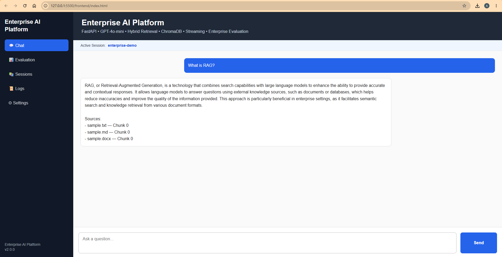
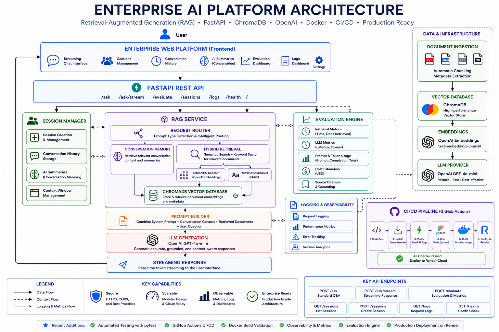
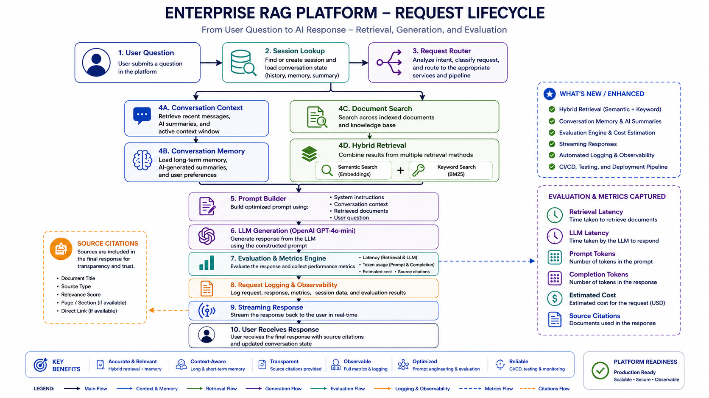
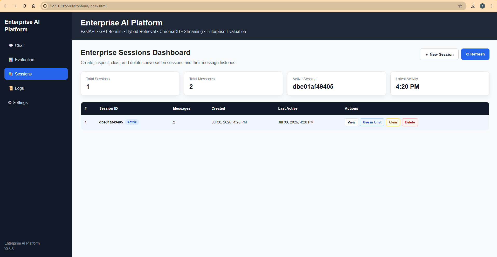
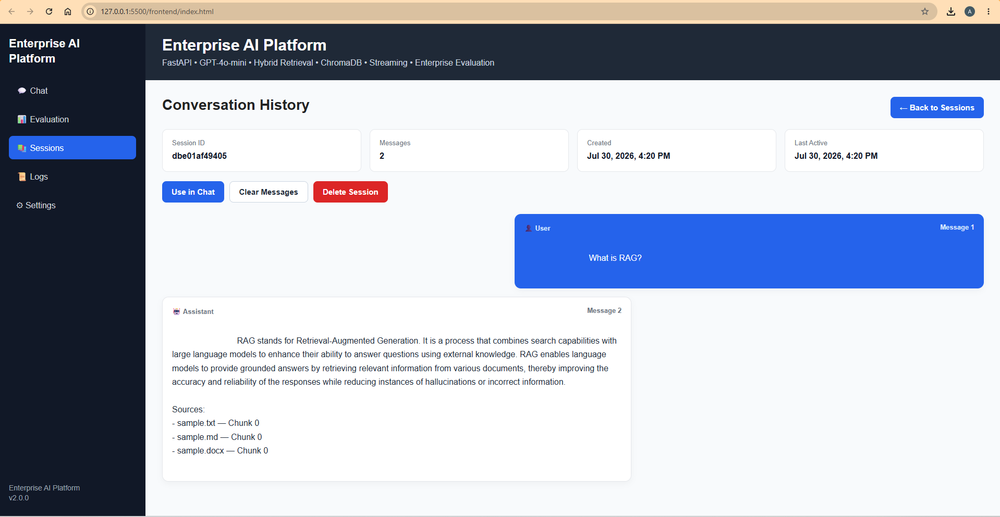
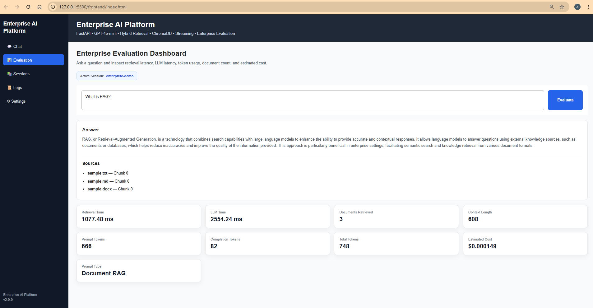
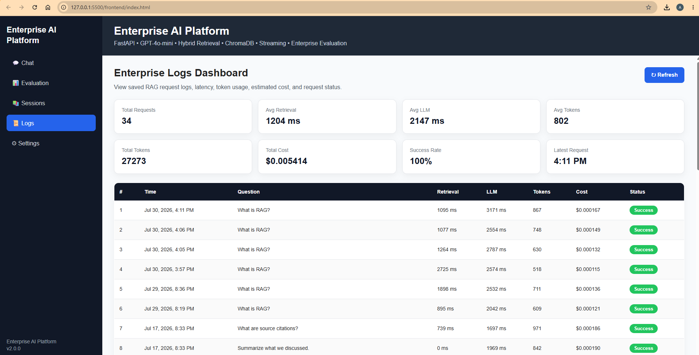
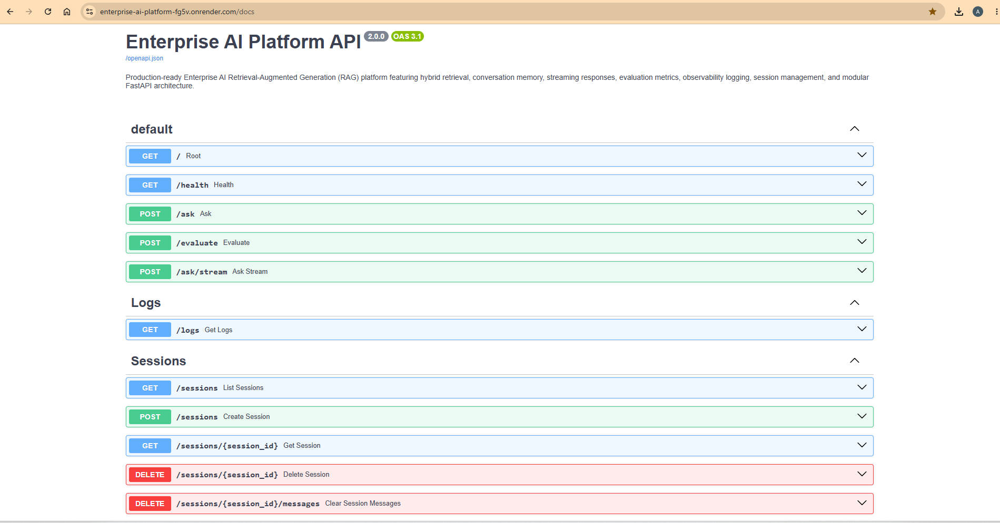
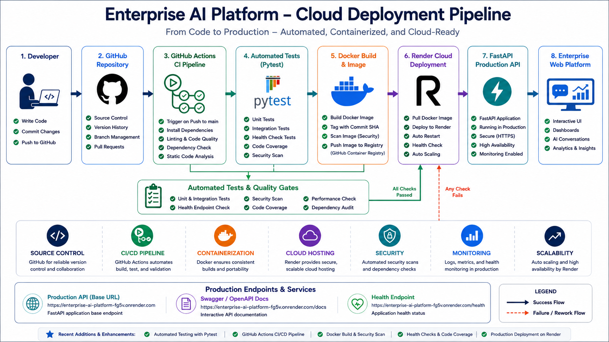

<div align="center">

#  Enterprise AI Platform

### Production-Ready Enterprise AI Platform


## Overview

**Enterprise AI Platform** is a production-ready Retrieval-Augmented Generation (RAG) application built with **FastAPI**, **OpenAI GPT-4o-mini**, **ChromaDB**, **Docker**, **GitHub Actions**, and **Render Cloud**.

The platform combines hybrid retrieval, conversation memory, AI-generated conversation summaries, streaming responses, evaluation metrics, logging & observability, automated testing with **Pytest**, and a fully automated **GitHub Actions CI/CD** pipeline for reliable cloud deployment.

Every push to the `main` branch automatically validates the FastAPI application, executes automated tests, builds the Docker image, and deploys the latest version to Render Cloud after all quality checks pass.

---

###  Live Demo

**API:** https://enterprise-ai-platform-fg5v.onrender.com

**Swagger:** https://enterprise-ai-platform-fg5v.onrender.com/docs

**Health:** https://enterprise-ai-platform-fg5v.onrender.com/health

</div>

---



---

## Enterprise Features

- Hybrid Retrieval (Semantic + Keyword Search)
- GPT-4o-mini Integration
- Session-Based Conversation Memory
- Streaming AI Responses
- Enterprise Evaluation Dashboard
- Request Logging & Observability
- Source Citations
- Docker Containerization
- GitHub Actions CI/CD
- Cloud Deployment on Render

---

#  Quick Start

Clone the repository:

```bash
git clone https://github.com/aramradif/Enterprise-AI-Platform.git
cd Enterprise-AI-Platform
```

Create and activate a virtual environment:

```bash
python -m venv .venv

# Windows
.venv\Scripts\activate

# macOS / Linux
source .venv/bin/activate
```

Install dependencies:

```bash
pip install -r requirements.txt
```

Start the API server:

```bash
uvicorn main:app --reload
```

Open in your browser:

- **Swagger API Documentation:** http://127.0.0.1:8000/docs
- **Health Check:** http://127.0.0.1:8000/health
- **Web Interface:** http://127.0.0.1:5500/frontend/index.html

---

#  Table of Contents

- [Overview](#overview)
- [System Architecture](#system-architecture)
- [Enterprise Web Platform](#enterprise-web-platform)
- [Key Features](#key-features)
- [Technology Stack](#technology-stack)
- [Project Structure](#project-structure)
- [Installation](#installation)
- [Running the Backend API](#running-the-backend-api)
- [API Endpoints](#api-endpoints)
- [Docker Deployment](#docker-deployment)
- [Cloud Deployment](#cloud-deployment)
- [GitHub Actions (CI)](#github-actions-ci)
- [Roadmap](#roadmap)
- [Author](#author)

---

# Overview

Enterprise AI Platform is a production-ready Retrieval-Augmented Generation (RAG) application that demonstrates modern enterprise AI engineering practices using FastAPI, OpenAI, ChromaDB, Docker, GitHub Actions, and Render Cloud.

The platform goes beyond a traditional RAG chatbot by providing a complete enterprise AI architecture with hybrid retrieval, conversation memory, session management, streaming responses, evaluation metrics, request logging, and cloud deployment.

Key capabilities include:

- Retrieval-Augmented Generation (RAG)
- Hybrid Retrieval (Semantic + Keyword Search)
- OpenAI GPT-4o-mini Integration
- ChromaDB Vector Database
- Multi-format Document Ingestion
- Session-Based Conversation Management
- Conversation Memory & AI Summaries
- Streaming AI Responses
- Evaluation Dashboard
- Enterprise Logs Dashboard
- Token Usage & Cost Tracking
- Prompt Type Detection
- Source Citations
- RESTful FastAPI API
- Interactive Enterprise Web Interface
- Docker Containerization
- Automated Testing (Pytest)
- GitHub Actions CI/CD Pipeline
- Automated Render Deployment

The project follows a modular enterprise architecture designed for scalability, maintainability, and production deployment while showcasing real-world AI engineering workflows.

---

#  Enterprise Highlights

Enterprise AI Platform demonstrates the architecture, engineering practices, and deployment strategies used in modern enterprise AI applications. It combines scalable backend engineering, Retrieval-Augmented Generation (RAG), cloud deployment, observability, and DevOps into a production-ready AI platform.

---

##  AI & Retrieval

- Retrieval-Augmented Generation (RAG)
- Hybrid Retrieval (Semantic + Keyword Search)
- OpenAI GPT-4o-mini
- OpenAI Embeddings
- ChromaDB Vector Database
- Multi-format Document Ingestion
- Intelligent Context Selection
- Grounded AI Responses with Source Citations

---

##  Conversation Intelligence

- Session-Based Conversation Management
- Conversation Memory
- AI-Generated Conversation Summaries
- Multi-turn Conversations
- Intelligent Request Routing
- Context-Aware Responses
- Streaming AI Responses

---

##  Enterprise Platform

- Interactive Enterprise Web Interface
- Streaming Chat Experience
- Sessions Dashboard
- Conversation History
- Evaluation Dashboard
- Logs Dashboard
- Swagger / OpenAPI Documentation
- RESTful FastAPI API

---

##  AI Evaluation & Observability

- Retrieval Latency
- LLM Latency
- Prompt Type Detection
- Token Usage
- Prompt & Completion Token Tracking
- Estimated Cost Tracking
- Request Logging
- Enterprise Metrics Dashboard
- Source Citations

---

##  DevOps & Cloud Deployment

- Docker Containerization
- Docker Compose
- GitHub Actions CI/CD
- Render Cloud Deployment
- Environment Variable Management
- Production Health Checks
- Modular Enterprise Architecture

#  System Architecture



The Enterprise AI Platform follows a modular, layered architecture that separates the presentation layer, API services, AI orchestration, retrieval pipeline, conversation management, observability, and deployment infrastructure. This design promotes scalability, maintainability, and production readiness.

A user request enters through the Enterprise Web Platform or the REST API hosted on FastAPI. The request is routed to the RAG Service, which determines whether the query requires document retrieval or can be answered using conversation memory and session context.

For knowledge-based questions, the platform performs Hybrid Retrieval by combining semantic vector search with keyword search to identify the most relevant document chunks stored in ChromaDB. Retrieved context is combined with conversation history to build a grounded prompt for GPT-4o-mini, enabling accurate, context-aware responses with source citations.

Every request is evaluated and logged to capture retrieval latency, LLM latency, token usage, estimated cost, prompt type, routing decisions, and citations. These metrics power the Evaluation Dashboard and Logs Dashboard, providing enterprise-grade AI observability.

The platform is containerized with Docker, continuously validated using GitHub Actions, and deployed on Render Cloud, demonstrating a complete production-oriented AI engineering workflow.

---

## Request Lifecycle



The request lifecycle illustrates how a user request flows through the Enterprise AI Platform. Each question is routed through session management, conversation memory, hybrid retrieval, prompt construction, GPT-4o-mini, evaluation, logging, and finally streamed back to the user with grounded source citations.

---

#  Enterprise Web Platform

The Enterprise Web Platform provides an interactive interface for communicating with the FastAPI backend and managing AI conversations through a modern, dashboard-driven experience.

Current capabilities include:

- Streaming AI Chat
- Session Management
- Conversation History
- Enterprise Evaluation Dashboard
- Logs Dashboard
- Hybrid Retrieval
- Conversation Memory
- AI-Generated Conversation Summaries
- Real-Time Evaluation Metrics
- Token Usage Tracking
- Estimated Cost Reporting
- Source Citations
- Persistent Chat State
- Sidebar Navigation

The platform is designed with a modular architecture that can be extended with authentication, administrative tools, cloud-native services, and additional enterprise AI capabilities as the project evolves.

---

##  Streaming Chat

Interact with the AI assistant through a real-time streaming interface that delivers responses incrementally for a faster, more responsive user experience. The chat interface supports conversation memory, context-aware responses, and grounded answers using Retrieval-Augmented Generation (RAG).


---

##  Sessions Dashboard

Create, manage, switch between, and delete conversation sessions. Each session maintains its own conversation history and memory, enabling independent multi-turn AI interactions.



---

##  Conversation History

Review previous conversations within each session to preserve long-term context and provide continuity across multiple user interactions. Conversation history supports AI-generated summaries and context-aware responses.



---

##  Evaluation Dashboard

Monitor AI performance through enterprise observability metrics, including retrieval latency, LLM latency, prompt classification, token usage, estimated cost, routing decisions, and source citations for every request.



---

##  Logs Dashboard

Analyze request history and system activity through centralized logging. The dashboard provides visibility into AI requests, latency, token consumption, estimated cost, routing decisions, and overall platform performance for troubleshooting and monitoring.



---

# Project Status

**Current Version:** **v2.0**

**Release:** Production Cloud Deployment

The Enterprise AI Platform has evolved from a Retrieval-Augmented Generation (RAG) prototype into a production-ready enterprise AI application featuring cloud deployment, observability, conversation management, and a modern web platform.

Status:

✔ Production Ready

✔ Dockerized

✔ CI/CD Enabled

✔ Cloud Deployed

✔ Automated Testing

✔ Enterprise Architecture

✔ Observability & Evaluation

---

## Latest Release (v2.0)

### New Features

- Enterprise Session Management
- Conversation History Dashboard
- Enterprise Evaluation Dashboard
- Enterprise Logs Dashboard
- Intelligent Request Routing
- Source Citations
- Prompt Type Detection
- Streaming AI Responses
- Hybrid Retrieval (Semantic + Keyword)
- Conversation Memory & AI Summaries
- Session Lifecycle API
- Production Health Endpoint
- Docker Containerization
- GitHub Actions CI/CD Pipeline
- Cloud Deployment on Render

---

### Improvements

- Production-Ready Enterprise Web Platform
- Enhanced Evaluation Metrics
- Token Usage & Cost Tracking
- Improved API Documentation
- Professional Dashboard Layout
- Modernized Modular Architecture
- Enterprise Observability
- Improved Session Management

---

# Key Features

## AI & Retrieval

- Retrieval-Augmented Generation (RAG)
- Hybrid Retrieval (Semantic + Keyword Search)
- OpenAI GPT-4o-mini Integration
- OpenAI Embeddings
- ChromaDB Vector Database
- Multi-format Document Ingestion (PDF, DOCX, TXT, Markdown)
- Intelligent Context Selection
- Source-aware Responses with Citations

---

## Conversation Intelligence

- Session-Based Conversation Management
- Conversation Memory
- AI-Generated Conversation Summaries
- Multi-turn Conversations
- Context-Aware Responses
- Intelligent Request Routing
- Streaming AI Responses

---

## Enterprise Web Platform

- Interactive Enterprise Web Interface
- Streaming Chat
- Sessions Dashboard
- Conversation History Dashboard
- Evaluation Dashboard
- Logs Dashboard
- Persistent Chat State
- Sidebar Navigation

---

## API & Backend

- RESTful FastAPI API
- Interactive Swagger / OpenAPI Documentation
- Streaming API Endpoint
- Evaluation API
- Session Lifecycle API
- Health Monitoring Endpoint
- Request Logging
- Modular Service-Oriented Architecture

---

## AI Evaluation & Observability

- Retrieval Latency Metrics
- LLM Latency Metrics
- Prompt Type Detection
- Token Usage Tracking
- Prompt & Completion Token Counts
- Estimated Cost Tracking
- Source Citations
- Enterprise Metrics Dashboard

---

## DevOps & Deployment

- Docker Containerization
- GitHub Actions CI/CD
- Automated Testing with Pytest
- Automated Deployment to Render Cloud
- Environment Variable Management
- Production Health Checks

---

## Developer Experience

- Clean Modular Architecture
- Reusable Components
- Configuration-Based Design
- Extensible Project Structure
- Production-Ready Codebase

---

# Automated CI/CD Pipeline

Every push to the `main` branch automatically executes the following workflow:

1. Install project dependencies
2. Validate Python source code
3. Verify FastAPI application startup
4. Execute automated Pytest tests
5. Build the Docker container image
6. Trigger automated deployment to Render Cloud

Deployment occurs only after all validation and automated tests pass successfully.

---

# Technology Stack

## Backend

- Python 3.14
- FastAPI
- Uvicorn
- Pydantic

---

## Artificial Intelligence

- OpenAI GPT-4o-mini
- OpenAI text-embedding-3-small
- Retrieval-Augmented Generation (RAG)
- Hybrid Retrieval (Semantic + Keyword Search)
- Prompt Engineering

---

## Vector Database

- ChromaDB

---

## Document Processing

- PDF (pypdf)
- DOCX (python-docx)
- TXT
- Markdown

---

## Frontend

- HTML5
- CSS3
- JavaScript (ES Modules)

---

## DevOps & Deployment

- GitHub Actions
- Pytest
- Docker
- Render Cloud

---

## Development

- Git
- GitHub
- VS Code

---

# Project Structure

```text
Enterprise-AI-Platform/
│
├── .github/
│   └── workflows/
│
├── app/
│   ├── api/
│   ├── config/
│   ├── core/
│   ├── embeddings/
│   ├── evaluation/
│   ├── ingestion/
│   ├── llm/
│   ├── memory/
│   ├── models/
│   ├── retrieval/
│   └── services/
│
├── assets/
├── data/
├── frontend/
│   ├── js/
│   └── pages/
│
├── scripts/
├── tests/
│
├── Dockerfile
├── main.py
├── requirements.txt
└── README.md
```

---

# Installation

Clone the repository:

```bash
git clone https://github.com/aramradif/Enterprise-AI-Platform.git
cd Enterprise-AI-Platform
```

Create and activate a virtual environment:

```bash
python -m venv .venv

# Windows
.venv\Scripts\activate

# macOS / Linux
source .venv/bin/activate
```

Install dependencies:

```bash
pip install -r requirements.txt
```

---

# Running the Backend API

Start the FastAPI development server:

```bash
uvicorn main:app --reload
```

Available locally:

- **Swagger UI:** http://127.0.0.1:8000/docs
- **Health Check:** http://127.0.0.1:8000/health



---

# API Endpoints

The Enterprise AI Platform exposes a RESTful FastAPI API for Retrieval-Augmented Generation (RAG), streaming responses, session management, evaluation, and enterprise observability.

All endpoints are documented through the interactive Swagger / OpenAPI interface.

| Method | Endpoint | Description |
|----------|----------|-------------|
| GET | `/` | API information |
| GET | `/health` | Health check |
| POST | `/ask` | Standard RAG question answering |
| POST | `/ask/stream` | Streaming AI responses |
| POST | `/evaluate` | Enterprise evaluation with performance metrics |
| GET | `/logs` | Retrieve request logs and observability metrics |
| GET | `/sessions` | List all conversation sessions |
| POST | `/sessions` | Create a new conversation session |
| GET | `/sessions/{session_id}` | Retrieve a session and its conversation history |
| DELETE | `/sessions/{session_id}` | Delete a conversation session |
| DELETE | `/sessions/{session_id}/messages` | Clear all messages within a session |

---

# Enterprise Web Platform

Launch the frontend using VS Code Live Server.

Open:

```text
http://127.0.0.1:5500/frontend/index.html
```

Current capabilities include:

- Streaming AI Chat
- Session Management
- Conversation History
- Conversation Memory
- AI-Generated Conversation Summaries
- Evaluation Dashboard
- Logs Dashboard
- Source Citations
- Real-Time AI Metrics
- Persistent Chat State
- Sidebar Navigation

The Enterprise Web Platform provides an interactive interface for managing AI conversations, monitoring system performance, and exploring enterprise observability metrics through a modern dashboard experience.

---

# Cloud Deployment Pipeline



The Enterprise AI Platform follows a modern deployment workflow. Source code is managed in GitHub, validated through GitHub Actions, containerized with Docker, and deployed to Render Cloud. This pipeline enables automated builds, reliable deployments, and a production-ready API.

---

# Roadmap

The Enterprise AI Platform is being developed incrementally with a focus on production-ready AI engineering practices.

## Completed

### Enterprise Retrieval

- Hybrid Retrieval (Semantic + Keyword Search)
- ChromaDB Vector Database
- OpenAI Embeddings
- Multi-format Document Ingestion
- Automatic Document Chunking
- Intelligent Context Selection

### Intelligent Generation

- GPT-4o-mini Integration
- Grounded AI Responses
- Source Citations
- Streaming AI Responses
- Prompt Engineering

### Conversation Intelligence

- Session Management
- Conversation Memory
- AI-Generated Conversation Summaries
- Conversation History
- Intelligent Request Routing

### Enterprise Platform

- Interactive Enterprise Web Platform
- Sessions Dashboard
- Evaluation Dashboard
- Logs Dashboard
- Swagger / OpenAPI Documentation
- Enterprise Navigation

### AI Observability

- Retrieval Latency Metrics
- LLM Latency Metrics
- Prompt Type Detection
- Token Usage Tracking
- Cost Estimation
- Request Logging

### DevOps & Deployment

- Docker Containerization
- GitHub Actions CI/CD Pipeline
- Render Cloud Deployment
- Production Health Endpoint

---

## In Progress

- Authentication & Authorization
- Redis Caching
- PostgreSQL Persistence
- Comprehensive Unit Testing
- Integration Testing

---

## Future Enhancements

- Role-Based Access Control (RBAC)
- Kubernetes Deployment
- Prometheus & Grafana Monitoring
- MCP Integration
- Multi-Agent Workflows
- Enterprise Security
- Horizontal Scaling

---

# Project Goals

The Enterprise AI Platform was built to demonstrate modern enterprise AI engineering by combining Retrieval-Augmented Generation (RAG), large language models, vector databases, conversation intelligence, observability, and cloud deployment into a production-ready application.

Beyond implementing AI capabilities, the project emphasizes scalable software architecture, modular backend development, API design, DevOps practices, and production deployment. It serves as a practical demonstration of designing, building, deploying, and maintaining enterprise-grade AI systems.

Future development will focus on authentication, distributed caching, persistent storage, advanced monitoring, Kubernetes orchestration, and agentic AI workflows to further expand the platform.

---

# License

This project is licensed under the MIT License.